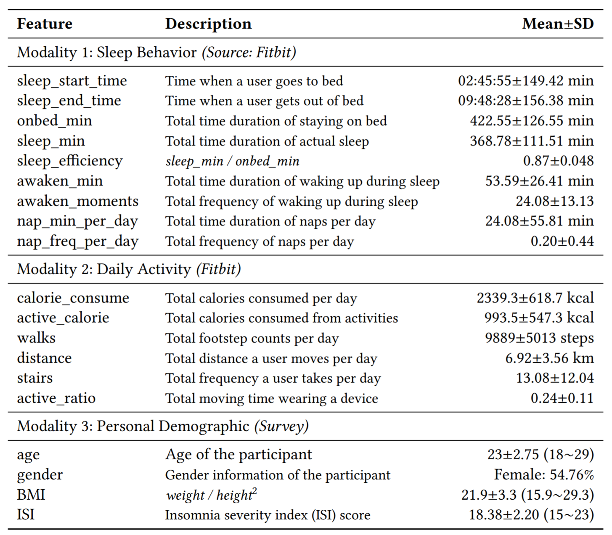

# Learning-Sleep-Quality-from-Daily-Logs
Implementation of Learning Sleep Quality from Daily Logs in Tensorflow.

### Data
Table 1 displays the list of data features gathered by the Fitbit device and the user surveys. All features without "onbed_min" (which was excluded due to its strong correlation with other sleep features.) were used in this project. 
Sample data from four randomly selected users is uploaded in data folder. sample_data_sleeps_ORIGINAL.csv includes the data from Modality 1 and 2, and sample_meta-data_sleeps.csv includes the data from Modality 3.




### Required packages
The code has been tested running under Python 3.6.6. with the following packages installed (along with their dependencies):

- numpy == 1.16.0
- pandas == 0.23.4
- pyprind == 2.11.2
- tensorflow == 1.12.0
- scikit-learn == 0.20.2


### Part 1. MISSING DATA IMPUTATION
##### Model parameter
You can set parameter by modifying GAIN/parameter.json file. In our paper, to make an imputation , we used parameters as 
follows.

```

"GAIN": 
      {"file_path": "....../sample_data_sleeps_ORIGINAL.csv", "save_path": "....../impute_data.csv",  "epoch": 20000}
      
```

##### How to Run
```
1. Setting the path of parameter.json in main.py
   (For example : If your parameter.json is located in 'user/Documents/data/parameter.json',you should set it as json_path in 
    main.py)
2. Setting parameter in parameter.json:
   (For example : If your sample_data_sleeps_ORIGINAL.csv is saved in 'user/Documents/data/sample_data_sleeps_ORIGINAL.csv',
    you should set it as parameter in parameter.json ; If you want to save imputed data,you should set the path whwere you       
    want to save a parameter in parameter.json)
3. python main.py -- After you finish step 1,2 , you can execute main.py and get imputed data.
                   
``` 

### Part 2. SLEEP EFFICIENCY PREDICTION
##### Model parameter
You can set parameter by modifying Sleep_Efficiency_Prediction/model_parameter.json file. In our paper, to make a prediction, we used parameters as follows.

```
{
  "phase1_parameter": {
    "batch_size" : 35,
    "learning_rate" : 1e-4,
    "epoch" : 400,
    "keep_prob" : 0.8,
    "step1_hidden_size": 200,
    "step2_hidden_size": 75,
    "step3_hidden_size": 50,
    "step4_hidden_size": 100,
    "step5_hidden_size": 90,
    "step6_hidden_size": 100, 
    "step7_hidden_size": 500,
    "optimizer": "AdamOptimizer"
  },
  
  "phase2_parameter": {
    "batch_size" : 35,
    "learning_rate" : 1e-4,
    "epoch" : 400,
    "keep_prob" : 0.8,
    "query_size" : 70,
    "metadata_hidden_size1": 90,
    "metadata_hidden_size2": 50,
    "optimizer": "AdamOptimizer"
  }
}
```

##### How to Run
```
usage: main.py [-h] [--model_name MODEL_NAME] [--impute IMPUTE] [--load] [--printlog]
optional arguments:
  -h, --help            show this help message and exit
  --model_name MODEL_NAME
                        Name of the model
  --impute IMPUTE       Method for filling data, select from BLANK, AVERAGE,
                        and GAIN
  --load                With this option, load trained phase 1 and phase 2
                        model. Otherwise, train new one
  --printlog            With this option, print train log in the prompt.
                        Otherwise, no logs are printed

```

##### Example
```
$ cd Sleep_Efficiency_Prediction
$ python main.py --model_name TEST_MODEL --impute GAIN --printlog
```


##### Result
Result files are saved in Sleep_Efficiency_Prediction/result
Log files(with --printlog option) are saved in Sleep_Efficiency_Prediction/log.
Models are saved in Sleep_Efficiency_Prediction/model.
You can load model with --load option with proper MODEL_NAME and corresponding parameter file.


##### Additional Report for the Attention Scores


### Part 3. INSOMNIA RANKING
##### Model parameter
You can set parameter by modifying Isomnia_Ranking/parameter.json file. In our paper, to make an imputation , we used 
parameters as follows.

```
"Isomnia_Ranking": 
           {"file_path": "....../sample_data_sleeps_Imp-GAIN.csv", "threshold": 0.006, "main_effect_location": 4}
```

##### How to Run
```
1. Setting the path of parameter.json in main.py
   (For example : If your parameter.json is located in 'user/Documents/data/parameter.json',you should set it as json_path in 
    main.py)
2. Setting parameter in parameter.json:
   (For example : If your sample_data_sleeps_Imp-GAIN.csv is saved in 'user/Documents/data/sample_data_sleeps_Imp-GAIN.csv',
    you should set it as parameter in parameter.json ; If you want to save imputed data,you should set the path whwere you       
    want to save a parameter in parameter.json)
3. python main.py -- After you finish step 1,2 , you can execute main.py and get rank result.

```
